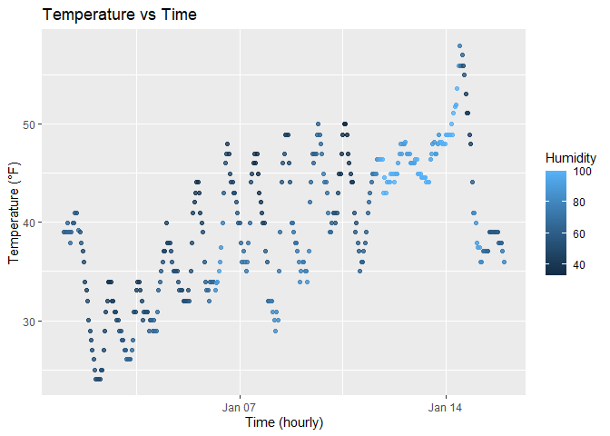

p8105_hw1_yd2865
================
Yan Duan
2025-09-16

I’m an R Markdown document!

``` r
# Load early_january_weather dataset

data("early_january_weather")
```

# Problem 1:

Assign the dataset `early_january_weather` to a new object named
`weather_df` to facilitate subsequent plotting and analysis.

``` r
weather_df <- early_january_weather
```

- This dataset records hourly weather observations, including variables
  such as temperature (`temp`), time (`time_hour`), and humidity
  (`humid`).
- The dataset has 358 rows and 15 columns. The average temperature is
  approximately 39.58 °F.

``` r
# Use ggplot2 to draw a scatter plot.

ggplot(weather_df, aes(x = time_hour, y = temp, color = humid)) + 
  geom_point(alpha = 0.8) +
  labs(
    x = "Time (hourly)",
    y = "Temperature (°F)",
    color = "Humidity",
    title = "Temperature vs Time"
  )
```

<!-- -->

From the scatter plot, it can be seen that within the time period of the
data recording, the temperature gradually increased over time.

Meanwhile, the change in humidity is shown through the color of the
points, when the humidity is high, the color is lighter, and when the
humidity is low, the color is darker.

It indicates that the distribution of temperature and humidity over time
has a distinct pattern.

``` r
# Export the scatterplot to my project directory 

ggsave("Temperature vs Time.jpg",
  width = 7, height = 6, dpi = 300)
```

# Problem 2:

``` r
# Create a data frame named `sample_df` that contains four different types of variables.

set.seed(1234)
sample_df = tibble(
  normal_sample = rnorm(10),
  pos = normal_sample > 0,
  char_vec = as.character(1:10),
  fac_vec = factor(
  rep(c("low","med","high"), length.out = 10))
)
```

Use `pull` function to take the mean value for each variable:

``` r
mean(pull(sample_df, normal_sample))
```

    ## [1] -0.3831574

The type is numeric. The average result of this type is meaningful. The
result is the average value of these 10 random numbers.

``` r
mean(pull(sample_df, pos))
```

    ## [1] 0.4

The type is logical (TRUE = 1, FALSE = 0). The average result of this
type is meaningful and the result indicates the proportion of positive
numbers.

``` r
mean(pull(sample_df, char_vec))
```

    ## Warning in mean.default(pull(sample_df, char_vec)): argument is not numeric or
    ## logical: returning NA

    ## [1] NA

The type is character. Character type cannot be directly subjected to
arithmetic operations. Executing `mean(char_vec)` will result in an
error.

``` r
mean(pull(sample_df, fac_vec))
```

    ## Warning in mean.default(pull(sample_df, fac_vec)): argument is not numeric or
    ## logical: returning NA

    ## [1] NA

The type is factor. And the result itself has no practical significance
because the average cannot be directly calculated for the factor.
Executing `mean(fac_vec)` will result in an error. It is necessary to
convert it to the numeric type before calculation.

``` r
#convert variables from one type to another.

sample_df_converted <- transform(
  sample_df,
    pos_num  = as.numeric(pos),   
    char_vec_num  = as.numeric(char_vec),   
    fac_vec_num   = as.numeric(fac_vec)
  )
```

- `pos` is of logical type (TRUE/FALSE). After the conversion: TRUE = 1,
  FALSE = 0. The result will be a 0/1 numeric vector, indicating whether
  `normal_sample` is greater than 0.
- `char_vec` is of character type (“1”, “2”, …, “10”). The function
  `as.numeric()` attempts to convert the characters into numerical
  values ranging from 1 to 10.
- `fac_vec` is of factor type, with levels “low”, “med” and “high”.
  `as.numeric()` returns the integer encoding corresponding to the
  factor levels: “low” = 1, “med” = 2, “high” = 3. So this column will
  become a numerical vector consisting of the numbers 1, 2, and 3.
